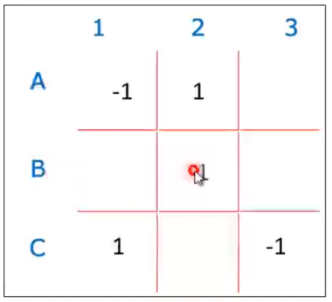

# Jogo da Velha

  - A jogada sempre será iniciada pelo jogador 1
  - O jogador 1 marca o ponto -1
  - O jogador 2 marca o ponto 1
  - A cada rodada deve-se verificar os pontos na horizontal, vertical e diagonal
  - Se o resultado da verificação retornar -3, jogador 1 ganhou a partida
  - Se o resultado da verificação retornar 3, jogador 2 ganhou a partida